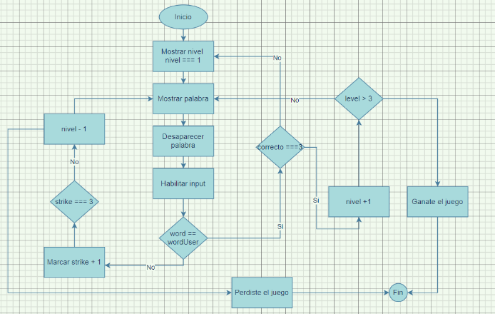

# Juego de memoria
Aplicación para poner a prueba tus conocimietos de palabras en ingles, y la memoria, a medida que subes de nivel las palabras son mas complejas y el tiempo de muestra más corto.

# Live version 

https://jimmyanaya.github.io/Juego-de-memoria/wordsTime

# Logica de desarrollo

